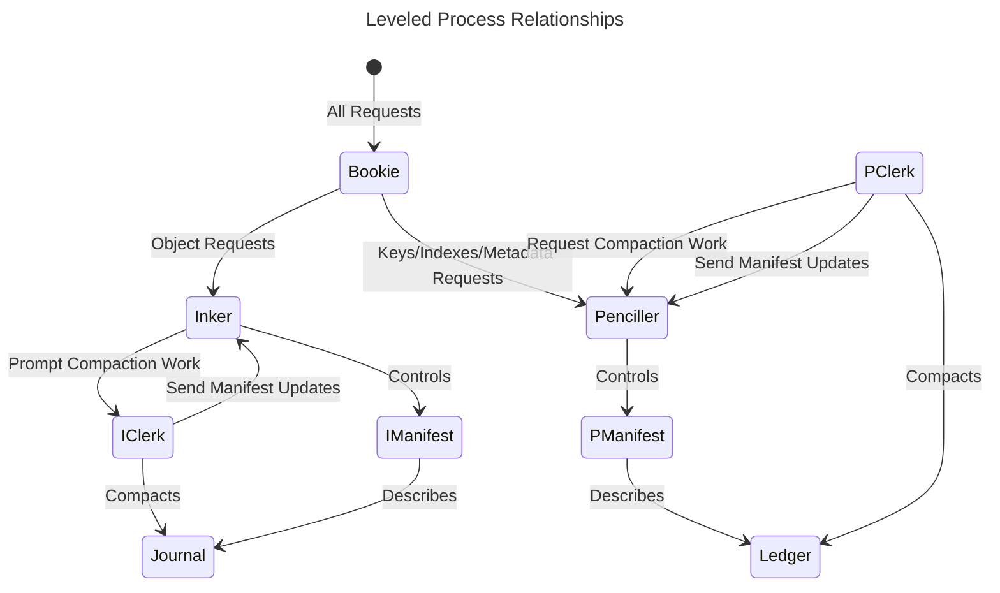

Explain how leveled stores data, its constraints, and the workloads for which it is appropriate.

## Overview

### Leveled

[glossary vnode]: kv/3.4.0/explanation/foundations/glossary/#vnode
[config reference]: kv/3.4.0/reference/configuration/
[perf index]: kv/3.4.0/how-to/tune/
[config reference#aae]: kv/3.4.0/reference/configuration/#active-anti-entropy

[leveled](https://github.com/martinsumner/leveled)

Leveled is a simple Key-Value store based on the concept of Log-Structured Merge Trees, with the following characteristics:

- Optimised for workloads with larger values (e.g. > 4KB).
- Explicitly supports HEAD requests in addition to GET requests:
- Splits the storage of value between keys/metadata and body (assuming some definition of metadata is provided);
- Allows for the application to define what constitutes object metadata and what constitutes the body (value-part) of the object - and assign tags to objects to manage multiple object-types with different extraction rules;
- Stores keys/metadata in a merge tree and the full object in a journal of CDB files
- Allowing for HEAD requests which have lower overheads than GET requests; and
- Queries which traverse keys/metadatas to be supported with fewer side effects on the page cache than folds over keys/objects.
- Support for tagging of object types and the implementation of alternative store behaviour based on type.
- Allows for changes to extract specific information as metadata to be returned from HEAD requests;
- Potentially usable for objects with special retention or merge properties.
- Support for low-cost clones without locking to provide for scanning queries (e.g. secondary indexes).
- Low cost specifically where there is a need to scan across keys and metadata (not values).
- Written in Erlang as a message passing system between Actors.

#### Strengths

1. leveled was developed specifically as a potential backend for Riak, with features such as:
      * Support for secondary indexes
      * Multiple fold types
      * Auto expiry of objects
    Enabling compression means more CPU usage but less disk space. Compression
    is especially good for text data, including raw text, Base64, JSON, etc.
2. Optimised for workloads with larger values (e.g. > 4KB).
3. Explicitly supports HEAD requests in addition to GET requests.
4. Support for low-cost clones without locking to provide for scanning queries (e.g. secondary indexes).

#### Weaknesses

1. Leveled is still a comparatively new technology and more likely to suffer from edge case issues than Bitcask or LevelDB simply because they've been around longer and have been more thoroughly tested via usage in customer environments.
2. Leveled works better with medium to larger sized objects. It works perfectly well with small objects but the additional diskspace overhead may render LevelDB a better choice if disk space is at a premium and all of your data will be exclusively limited a few KB or less. This may change as Leveled matures though.

#### Installing leveled

Leveled is included with OpenRiak KV 3.2.5 and beyond, so there is no need to install anything further.

```riakconf
storage_backend = leveled
```

```appconfig
{riak_kv, [
    %% ...
    {storage_backend, riak_kv_leveled_backend},
    %% ...
    ]}
```

#### Configuring leveled

Leveled's default behavior can be modified by adding/changing
parameters in the `leveled` section of the [`riak.conf`][config reference]. The section below details the parameters you'll use to modify leveled.

The configuration values that can be set in your
[`riak.conf`][config reference] for leveled are as follows:

Config | Description | Default
:------|:------------|:-------
`leveled.data_root` | leveled data root. | `./data/leveled`
`leveled.sync_strategy` | Strategy for flushing data to disk. | `none`
`leveled.compression_method` | Compression Method. | `native`
`leveled.compression_point` | Compression Point - The point at which compression is applied to the Journal. | `on_receipt`
`leveled.log_level` | Log Level - Set the minimum log level to be used within leveled. | `info`
`leveled.journal_size` | The approximate size (in bytes) when a Journal file should be rolled. | `1000000000`
`leveled.compaction_runs_perday` | The number of journal compactions per vnode per day | `24`
`leveled.compaction_low_hour` | The hour of the day in which journal compaction can start. | `0`
`leveled.compaction_top_hour` | The hour of the day, after which journal compaction should stop.  | `23`
`leveled.max_run_length` | Max Journal Files Per Compaction Run. | `4`

##### Recommended Settings

Below are **general** configuration recommendations for Linux
distributions. Individual users may need to tailor these settings for
their application.

###### sysctl

For production environments, please see [System Performance Tuning][perf index]
for the recommended `/etc/sysctl.conf` settings.

###### Block Device Scheduler

Beginning with the 2.6 kernel, Linux gives you a choice of four I/O
[elevator models](http://www.gnutoolbox.com/linux-io-elevator/). We
recommend using the NOOP elevator. You can do this by changing the
scheduler on the Linux boot line: `elevator=noop`.

###### No Entropy

If you are using https protocol, the 2.6 kernel is widely known for
stalling programs waiting for SSL entropy bits. If you are using https,
we recommend installing the
[HAVEGE](http://www.irisa.fr/caps/projects/hipsor/) package for
pseudorandom number generation.

###### clocksource

We recommend setting `clocksource=hpet` on your Linux kernel's `boot`
line. The TSC clocksource has been identified to cause issues on
machines with multiple physical processors and/or CPU throttling.

###### swappiness

We recommend setting `vm.swappiness=0` in `/etc/sysctl.conf`. The
`vm.swappiness` default is 60, which is aimed toward laptop users with
application windows. This was a key change for MySQL servers and is
often referenced in database performance literature.

#### Implementation Details

[Leveled](https://github.com/martinsumner/leveled) is an open source project that has been developed specifically as a backend option for Riak, rather than a generic backend.

#### Leveled

The leveled backend has the following characteristics and features:

- Pure erlang log-structured-merge (LSM) tree backend, designed and developed specifically for use within Riak.
  - Implementation in Erlang simplifies resource management as CPU scheduling of all Riak activity is under the control of the Erlang virtual machine.
- Differs from most other LSM implementations in that values are set-aside in a sequence-ordered journal, and only keys and metadata are placed in the key-ordered LSM-based ledger.  This provides for lower cost and more efficient reads when only keys and metadata are required (internally within Riak this is usually the case, even when the external user requires the value).  It also reduces the overhead of write amplification, supporting larger object sizes with greater efficiency.
- Internal optimisations to increase efficiency within Riak for the Tictac-based method of anti-entropy and inter-cluster reconciliation.
- Supports index entries as well as objects in the key-ordered ledger, to allow full use of the Riak Query API.
- Is the priority backend used within the OpenRiak community for both functional and non-functional testing of new releases.
- Generally requires significantly less memory than the total size of all the keys.
  - A fixed overhead (per vnode) of about 10K keys and metadata is kept in memory, plus 1% of the keys, plus 2-bytes per key.
- Guarding against out-of-memory errors is an operator responsibility.  The cluster should be expanded if the memory limit is close, the per-vnode memory overhead will not be proactively reduced.
  - Makes use of any spare memory of the system through proactive hints to the file-system page cache.

For further details on the design and implementation of the leveled backend refer to [the Riak Theory Guide](kv/3.4.0/explanation/storage/leveled/).

#### The leveled backend

The leveled store is written in Erlang, where each entity (e.g. file or manifest) in the datastore has a dedicated owning process; and a consistent view is maintained through that ownership model rather than by the management of locks to marshall access to resources between processes.  It is designed to be scaled out by running many stores, not by parallelism within the store itself.

> The design of leveled is based on the log-structure merge-tree (LSM) data structure, but unlike most other implementations of LSM trees the values are set-aside on receipt, and only keys and metadata are kept within the LSM tree.

The setting-aside of values reduces the write amplification associated with the compaction of the LSM tree, especially when the object metadata is much smaller in bytes than the object value.  It also provides a differential cost of read; whereby a HEAD request (to return metadata) is much lower cost than a GET request (return the whole object).  This differential cost makes the store suited to environments where HEAD requests are more common than GETs; which is the case within Riak as each cluster GET is formed normally from the result of 3 backend HEAD requests and just a single backend GET.

The leveled datastore is designed using an actor model, the primary actors being:

- A Bookie;
  - The single external-facing actor that handles the inbound queue of requests.
- An Inker;
  - An actor that supports a journal of values, that acts as an append-only log of objects received,
    - The journal being a collection of sequence-ordered files described in a manifest.
    - The journal being the primary source of truth in the store.
- A Penciller;
  - An actor that controls a sorted ledger of keys (both object and index) and metadata,
    - The ledger being a collection of files described in a manifest, sorted by key at each level.
  - The ledger is not required to be reliable, in that the ledger can always be reconstructed from the journal.
- Worker Clerks;
  - Both the Penciller and Inker each have a dedicated clerk that is responsible for compaction; asynchronous changes to the organisation of the files which make up the system.
  - The clerks create the additional files required by the compacted system, and then inform the responsible actor (Inker or Penciller) of the required manifest changes to introduce those files.
- Files
  - Every file in leveled is an individual process, a state machine which owns a single file handle.
  - A file will first exist in a `write` mode, but once written will be switched to an immutable `read`-only mode.
    - The overall store is built on immutable files, compaction relies on the replacement of files, not the mutation of files.
  - Once a file is replaced in the manifest it will enter a `delete_pending` state, in which it will poll the controlling process (Inker or Penciller), to await confirmation that it may self-destruct (when no active manifest depends on it i.e. all relevant snapshots have closed).
- Snapshot Inker/Penciller
  - Both the Inker and Penciller can spawn clones, new processes with a replica of the manifest, registering the existence of those clones (or snapshots) in the primary Inker or Penciller.
- Monitor;
  - A central process for receiving stats from the other processes and reporting via scheduled logs the latest statistics for the store.



#### Caching and Acceleration

Each process within Leveled has an in-memory state, that contains:

- Information on the structure of the data kept by that process (e.g. a map of key ranges to on-disk data);
- A small cache of high priority information (e.g. an in-memory view of recent updates, or recent reads).

These caches are designed to ensure that every CRUD request can be fulfilled on average by 1 disk action or fewer.  All compaction activity is based on bulk writes of fresh files, not on mutation of existing files.  The leveled store, when compared to alternatives, requires a relatively low volume of internal I/O actions per external request.

> The leveled backend is focused on supporting characteristics that enable the file system page cache to be more effective, rather than managing its own caches to optimise performance.

Acceleration in leveled is provided through the use of hashes of keys, and the support throughout the system of hash-based lookups and lookup avoidance via bloom filters.  There is alignment between the hashes used by the ledger's filters for lookup avoidance and the hashes used in the anti-entropy merkle trees.  This alignment accelerates queries over key ranges when the results need to be filtered on leaves of the anti-entropy tree.

#### File Formats

The files within the Journal are ["Constant Database" files](https://en.wikipedia.org/wiki/Cdb_(software)), once they are moved into a `read` state.  There is one, and only one, active Journal file in a leveled store - and this is an append-only file that uses an in-memory table to map keys to file positions.  Upon migration to the `read` state a CDB hash table is appended to the end of the file.

The files within the Ledger are loosely based on the same concept as [block-based Static Sorted Tables SST (SSTs)](https://github.com/facebook/rocksdb/wiki/A-Tutorial-of-RocksDB-SST-formats).  Blocks are not governed by size (in bytes), but by number of keys which they contain (between 20 and 60 depending on the type of key); there is no alignment between blocks in the leveled SST files and blocks in the file system.  The table is divided into slots, where a slot is a group of five contiguous blocks (with between 128 and 256 keys per slot).

Data is serialised for persistence in Journal or Ledger files using a combination of the `zstd` compression algorithm and the Erlang standard `term_to_binary/1` function.  Other compression algorithms are supported - `none`, `native` (zlib) and `lz4`. In general, only `zstd` should be used, but in some specific scenarios `none` may be valid configuration for the Journal.  Grouping for serialisation is at an individual object level in the Journal, and by block in the Ledger - accessing an individual key in the ledger requires a whole block to be deserialised.

#### Data safety and security

The security of data within Leveled is provided by a combination of:

- Use of append-only writing of data to files, no internal manipulation of the file structure to manage mutation;
- Use of CRC checks on all serialised objects in both the Journal and the Ledger;
- The concurrency controls inherent in the model with the well defined process-scope for updating files and manifests;
- The ability to rebuild the Ledger from the Journal.

More detailed information on safety and security features [may be found in the leveled repository](https://github.com/martinsumner/leveled/issues/432).

#### Compaction

Compaction is managed in the ledger by the penciller's clerk (the `leveled_pclerk`), and in the Journal by the inker's clerk (the `leveled_iclerk`).

Compaction of the ledger is enforced by fresh write activity.  New writes to the store are appended to the active Journal file and then the related key and metadata changes added to an in-memory cache of recent ledger updates within the Bookie.  When the in-memory cache reaches an approximate threshold then the cache will be flushed to the in-memory cache of the Penciller.  When the number of the Penciller's in-memory cache lines reach an approximate threshold, it must write a new "level-zero" file to disk.

> All thresholds and timeouts in leveled are approximate, as any configured values must be jittered to avoid accidental coordination of activity between vnodes, either within a node or within a preflist.

The writing of a level zero file triggers a cascading process managed by the Penciller's Clerk.  When the clerk is next available it must merge that file from Level 0 into Level 1.  It then must look at the count of files at each level, and determine if any level is bigger than the fixed size for that level; and if it is, merge a file down to the lower level.  The maximum size of each level is based on file count alone.

When there are multiple outstanding lower level files to be merged, then the Penciller is in a backlog state.  In that backlog state the Penciller's Clerk will continue to prioritise freeing space in Level 0, but the Penciller will refuse to accept new cache lines from the in-memory cache of the Bookie.  The Bookie in turn should enter `slow-offer` mode, where it requests a pause from the vnode following a successful PUT to temporarily block more activity - this is logged and configured as a `backend_pause`.

> The pace of writes to a vnode cannot outrun the workload of the Penciller's Clerk, and the aim is to handle a backlog by gradually degrading responses in the system rather than suddenly stalling activity.

For individual leveled stores the Penciller's Clerk may be a bottleneck.  The clerk is single-threaded, as parallelism exists across the node by running multiple vnodes - there should normally be multiple vnodes (and hence clerks) per CPU core on each server.

Whereas ledger compaction is reactive to fresh write activity; the journal compaction is periodic, prompted by a jittered schedule of timeouts.  The journal compaction process is not blocking, in that it will __not__ prompt the `slow-offer` state if there is a backlog; a backlog of Journal compaction will result in an increasing overhead on disk space utilisation, not a slowdown in the store.

Journal compaction requires each file to be scored, the score being an assessment of the proportion of the file's space that would be freed by compacting the file.  Files are always compacted in contiguous groups to control the level of fragmentation in the Journal.  Scoring is done by reading a random set of keys and their value sizes, and checking against the ledger if the value in this Journal for each key is the active value in the Journal; and comparing the reclaimable space against the space required to be retained.

Once scoring is complete in a compaction run, any runs of files that exceed the configured compaction threshold are considered to be candidates for compaction, and the candidate run with the best score (the largest estimated volume of space to be freed) is chosen.  For that compaction run all keys are read in SQN order across the candidate files, checking in the ledger the current SQN of each Key and then either writing or discarding the object as appropriate.  Once a new set of files has been written and made read-only, the Inker's clerk will send the proposed change to the Inker to prompt a manifest update.

> Any crashes during compaction will lead to uncleared garbage rather than corruption; as the manifest change is made at the end, the store will always be restarted from the state at the commencement of the compaction job unless a compaction job is fully completed.

#### Head-only Mode

Leveled is used as the parallel-mode store for Tictac AAE, as well as an optional vnode storage backend.  When leveled is used in parallel mode AAE it is started in an alternative mode - `head-only` leveled.

When running in `head-only` mode, leveled is a metadata-only store: the ledger is now the source of truth, and the Journal is used only to persist batches of key/metadata changes that have not yet progressed from the in-memory ledger cache to the persisted files.  On startup, the ledger is started and the Journal is used to re-apply changes to the ledger from the sequence number of the last persisted change.

Should the Ledger be corrupted or lost in `head-only` mode, then it must be recovered from another source. In the case of leveled as a parallel-mode keystore for anti-entropy; it can be recovered by rebuilding from the vnode object store.

[strengths]: #strengths
[weaknesses]: #weaknesses
[installenable]: kv/3.4.0/explanation/storage/leveled/
[confiuring]: #configuring-leveled
