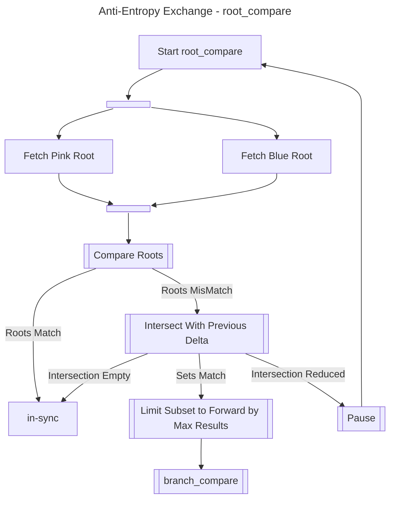

Explain active anti-entropy, its data flow, failure behavior, and operational trade-offs.

## Overview

### Active Anti-Entropy

[cluster ops v3 mdc]: reference/replication-api/runtime-controls/
[cluster ops aae]: how-to/operate/monitor-active-anti-entropy/
[concept clusters]: foundations/foundations/clusters-rings-and-partitions/
[concept eventual consistency]: foundations/consistency/eventual-consistency/
[config aae]: reference/configuration/#active-anti-entropy
[glossary read rep]: foundations/foundations/glossary/#read-repair
[glossary vnode]: foundations/foundations/glossary/#vnode
[Merkle tree]: http://en.wikipedia.org/wiki/Merkle_tree

In a [clustered][concept clusters], [eventually consistent][concept eventual consistency] system like Riak, conflicts between object replicas stored
on different nodes are an expected byproduct of node failure, concurrent
client updates, physical data loss and corruption, and other events that
distributed systems are built to handle. These conflicts occur when
objects are either

* **missing**, as when one node holds a replica of the object and
  another node does not, or
* **divergent**, as when the values of an existing object differ across
  nodes.

OpenRiak KV offers two means of resolving object conflicts: read repair and
active anti-entropy (AAE). Both of these conflict resolution mechanisms
apply both to normal key/value data in Riak as well as to
[search indexes][usage search]

#### Read Repair vs. Active Anti-Entropy

In versions of Riak prior to 1.3, replica conflicts were healed via
[read repair][glossary read rep] which is a _passive_
anti-entropy mechanism that heals object conflicts only when a read
request reaches Riak from a client. Under read repair, if the
[vnode][glossary vnode] coordinating the read request determines
that different nodes hold divergent values for the object, the repair
process will be set in motion.

One advantage of using read repair alone is that it doesn't require any
kind of background process to take effect, which can cut down on CPU
resource usage. The drawback of the read repair-only approach, however,
is that the healing process only can only ever reach those objects that
are read by clients. Any conflicts in objects that are not read by
clients will go undetected.

The _active_ anti-entropy (AAE) subsystem was added to Riak in
versions 1.3 and later to enable conflict resolution to run as a
continuous background process, in contrast with read repair, which does
not run continuously. AAE is most useful in clusters containing so-
called "cold data" that may not be read for long periods of time, even
months or years, and is thus not reachable by read repair.

Although AAE is enabled by default, it can be turned off if necessary.
See our documentation on [managing active anti-entropy][cluster ops aae]
for information on how to enable and disable AAE, as well as on configuring
and monitoring AAE.

#### Active Anti-Entropy and Hash Tree Exchange

In order to compare object values between replicas without using more
resources than necessary, Riak relies on [Merkle
tree] hash exchanges between
nodes.

Using this type of exchange enables Riak to compare a balanced tree of
Riak object hashes. Any difference at a higher level in the hierarchy
means that at least one value has changed at a lower level. AAE
recursively compares the tree, level by level, until it pinpoints exact
values with a difference between nodes. The result is that AAE is able
to run repair operations efficiently regardless of how many objects are
stored in a cluster, since it need only repair specific objects instead
of all objects.

In contrast with related systems, Riak uses persistent, on-disk hash
trees instead of in-memory hash trees. The advantages of this approach
are twofold:

* Riak can run AAE operations with a minimal impact on memory usage
* Riak nodes can be restarted without needing to rebuild hash trees

In addition, hash trees are updated in real time as new writes come in,
which reduces the time that it takes to detect and repair missing or
divergent replicas.

As an additional fallback measure, Riak periodically clears and
regenerates all hash trees from on-disk key/value data, which enables
Riak to detect silent data corruption to on-disk data arising from disk
failure, faulty hardware, and other sources. The default time period for
this regeneration is one week, but this can be adjusted in each node's
[configuration file][config aae].

#### Proactive reconciliation

Riak has support for proactive reconciliation within a cluster; known as [active anti-entropy (AAE)](foundations/replication/active-anti-entropy/).  Configuring AAE will trigger a background process that will continually verify that the most recent version of each object is correctly stored in all required locations, and prompt repairs should the verification process highlight discrepancies.  This is in addition to reactive management which is always enabled within Riak: as part of every GET request a read repair process may be triggered if all vnodes are not up-to-date; as part of failure management a handoff process will merge data captured on temporary fallback vnodes back into primary vnodes.

Proactive reconciliation provides continuous assurance that data is correctly secured across multiple devices within a cluster: it is verification as well as correction.  It is of particular use where data may be stored for long periods without being read, nullifying the trigger for reactive management via read repair.

There are two forms of proactive intra-cluster reconciliation in Riak:

- Tictac AAE (recommended).
  - Uses the [configuration option `tictacaae_active`](how-to/configure/basic-node-settings/).
  - A prerequisite for efficient inter-cluster reconciliation.
  - A prerequisite for the use of the [AAE Fold API](reference/aae-fold-api/).
  - Requires a secondary keystore if not using the leveled backend.
  - Limits the pace of repair activity when discrepancies are discovered.
- Legacy hashtree AAE (default).
  - Uses the configuration option `anti-entropy`.
  - Has a dependency on the deprecated `eleveldb` backend.
  - Requires a separate keystore for all backends.
  - More aggressive than Tictac AAE at resolving discovered discrepancies.

> If Tictac AAE is not enabled, there is an increased risk of data loss when Riak is used to store _cold_ data that is very rarely read.

Enabling Tictac AAE also adds to the cluster support for the operator-functionality associated with [AAE Folds](reference/aae-fold-api/).

#### Anti-Entropy

Riak tracks the current state of the Version Vectors across the whole key-space to perform anti-entropy, to recover an object to its most up-to-date value if a vnode has a stale or missing entry.  Anti-entropy can be used both within and between clusters, using special cached and mergeable merkle trees; these trees allow entropy to be tracked across large key-spaces highly efficiently.

Anti-entropy is in addition to other mechanisms that repair in reaction to the detection of failure (read repair), or in update vnodes following cluster changes (handoff for both repair, cluster change and recovery of fallbacks).

> The active anti-entropy process is designed to be highly efficient, and very quick, when confirming no deltas exist; o(10s) to confirm alignment between o(10bn) objects.

The work to compare between stores has a low resource cost.  The work to discover and repair deltas is relatively expensive, but is throttled in default configuration to avoid overloading the database.  As there are other anti-entropy mechanisms (e.g. quorum reads with read repair); slow repair is preferred to high repair-related resource utilisation.

The anti-entropy trees have 1,024 branches, and each branch has 1,024 leaves.  Each key in the store is mapped by a hash algorithm into a given leaf.  The hash value of that leaf is calculated by taking a hash of the Key and version vector combined, and then performing an `xor` operation on all the hashes within that leaf.  The hash value for each branch is the hash of each leaf in the branch combined using `xor`.

Each vnode has a cached tree for each preflist the vnode supports (with a single `n_val` in the cluster there will be `n_val` preflists in each vnode, and hence `n_val` cached trees per vnode). The cached tree represents the state for the whole preflist on the vnode.  When an object is modified, then the object key and the both the previous and current version vector is sent to the `aae_controller` for the vnode; which will update the correct preflist's tree cache, using a double xor operation.  In effect one xor to remove the previous hash, and one xor to add the new hash.

The intra-cluster anti-entropy can then compare the preflist tree for one vnode, with the preflist tree of another vnode within the same preflist, to confirm if the vnode's are in-sync for that preflist.  To make that comparison, only the 1,024 hashes (4KB) of the branches are compared, this is known as the root of the tree.  If there is a delta, then the same comparison will be run in a slow loop - checking for deltas which are constant across the loops.

If the `root compare` loop stabilises on a non-zero number of deltas, then the 1,024 leaves in those branches are compared in a loop to find a constant delta - this is then the `branch_compare` loop.  If there is no constant delta, the trees are considered in sync (i.e. any discovered delta was a matter of timing).

The `branch_compare` loop is an identical process to the `root_compare` loop, and if that confirms a consistent delta the `clock_compare` process is triggered.

If a set of leaves is discovered to be out-of-sync following `branch_compare`, the `clock_compare` process is initiated.  A `clock_compare` is a comparison between the objects in a subset of leaves to discover which objects need repair.  To compare the objects between vnodes, only the Version Vectors need to be compared.  To find the Keys and Version Vectors for a set of leaves, a fold over the whole keystore (either native or parallel) is required - however that fold is passed the segment IDs (an integer identifier for the leaves), and the store has in-built hints to filter out blocks of keys that do not contain segment IDs of interest.  This means the cost of finding Keys and Version Vectors is significant, but mitigated by the segment ID acceleration.

To limit the volume of data to be compared, and improve the performance of searches for Keys and Version Vectors, the number of segment results to be compared as a result of any exchange is limited.  All anti-entropy processes will also try to gather information from previous delta discoveries to intelligently reduce the scope of future discoveries.  For example, by looking at the modified date range in which differences fall, or if they are limited to specific buckets.  With information from previous deltas, the cost of finding more deltas can be reduced.

There exists the possibility that some event might cause the tree cache to become out of sync with the vnode backend store.  There are two processes to control this should it occur:

- when requested to find all Keys and Version Vectors for a set of segment IDs, the tree cache is also rebuilt for those leaves as part of the query.
- periodically there will be a cache rebuild event, where there will be a fold over the keystore, and a full rebuild of the tree cache.

When running Anti-entropy in parallel mode, there is also a need for periodic rebuilds of the keystore.  These may be expensive events, depending on the size and type of the store.  The rebuild jobs use random factors to try and prevent coordination of rebuilds between stores, and rebuilds are also queued using the node worker pool to prevent excessive concurrency of rebuilds.

Inter-cluster reconciliation uses the same principles as intra-cluster reconciliation.  For inter-cluster reconciliation the state of the clusters must be compared, not the state of the vnodes - two clusters may have different ring sizes, so a vnode-to-vnode reconciliation would not necessarily work.  To find the state of the cluster, the trees for all preflists can be merged into one tree using the `xor` operation.  Special coverage queries known as AAE folds, are used to either merge tree components, or to find Keys and Version Vectors across the cluster.

The cost of resolving entropy inter-cluster is higher than with intra-cluster entropy - and so the throttling of that resolution is generally stricter.
